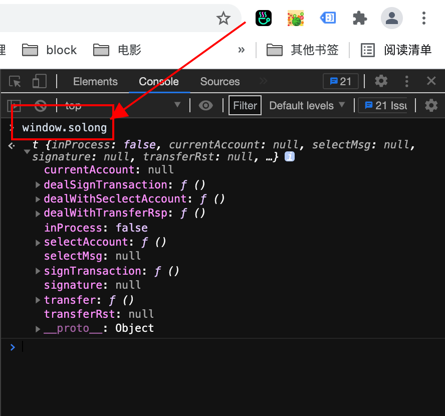

# solana dapp 前端开发

## 大纲

一、Account 账户理解

- 私钥
- 公钥
- 交易签名

二、交易 Transaction 介绍

- Transaction
- Instruction

三、solana/web3.js 介绍

- 创建 Account 账户
- 发送交易
- 确认交易

四、如何集成 solong wallet 到 DApp

五、solong wallet 功能简介

- 创建账号/导入账号
- 主界面
- mint 发币

## 一、Account 账户

### 私钥

**私钥**(H**********************************k)是私自保管不可示人的。
私钥是一串乱码，不好记，与之对应有一串**助记词**。

助记词可以通过算法推出**私钥**，所以实际上我们在使用钱包时，只要记住**助记词**。
好比你使用支付宝时候，不用输入支付密码，只需要伸出手指头或者露个脸扫描一下。那么手指头就相当于是支付密码的助记物。

### 公钥

**公钥**(HSfwVfB7KZp7TU25BeZZN16RUF1SKCd4yrz82YtdCTVk)是可以展示给别人看的。

**公钥**也是合约的地址。

在 Solana 上智能合约一般称为"Onchain Program"，所以**公钥**也叫 `ProgramID`。

## 二、交易 Transaction

`Transaction` 是由客户端向 Solana 节点发起请求的单元，一个`Transaction` 可能包含有多个 `Instruction`。Solana
节点在收到一个客户端发起的 `Transaction` 后，会先解析里面的每个`Instruction`，然后根据 `Instruction` 里面的
`ProgramID` 字段，来调用对应的智能合约，并将 `Instruction` 传递给该智能合约。

```js
export class Transaction {
    signatures: Array<SignaturePubkeyPair>;
    signature?: Buffer;
    // Transaction 包含多个 instructions
    instructions: Array<TransactionInstruction>;
    recentBlockhash?: Blockhash;
    nonceInfo?: NonceInformation;
    feePayer: PublicKey | null;

    constructor(opts?: TransactionCtorFields);
}
```

```js
export class TransactionInstruction {
    keys: Array<AccountMeta>;
    programId: PublicKey;
    data: Buffer;

    constructor(opts?: TransactionInstructionCtorFields);
}
```

### 指令 Instruction

`Instruction` 是智能合约处理的基本单元:


整体流程是 DApp 客户端将自定义的指令数据序列化
到 `data` 里面，然后将账号信息和 `data` 发到链上，Solana 节点为其找到要执行的程序，并将账号信息和数据 `data` 传递给合约程序，合约程序里面将这个 `data` 数据在反序列化，得到客户端传过来的具体参数。

## 三、solana/web3.js 介绍

### 1、创建 Account 账户

`Account` 类定义

```js
export class Account {
  constructor(secretKey?: Buffer | Uint8Array | Array<number>);
  publicKey: PublicKey;
  secretKey: Buffer;
}
```

创建一个 `account`

```js
import { Account } from "@solana/web3.js";

// secretKey 即私钥
const myAccount = new Account(secretKey);
```

### 2、发送交易 `sendTransaction`

`Transaction` 接口定义

```js
export class Transaction {
    signatures: Array<SignaturePubkeyPair>;
    signature?: Buffer;
    instructions: Array<TransactionInstruction>;
    recentBlockhash?: Blockhash;
    nonceInfo?: NonceInformation;
    feePayer?: PublicKey;

    constructor(opts?: TransactionCtorFields);
}

export type SignaturePubkeyPair = {
    signature?: Buffer;
    publicKey: PublicKey;
}
```

`sendTransaction` 方法

```js
/**
* Sign and send a transaction
*/
async sendTransaction(
    transaction: Transaction,
    signers: Array<Account>,
    options?: SendOptions,
): Promise<TransactionSignature>

/**
* Transaction signature as base-58 encoded string
*/
export type TransactionSignature = string;
```

<details>
  <summary>@solana/web3.js sendTransaction 方法实现</summary>
  <pre><code>  
/**
 * Sign and send a transaction
 */
async sendTransaction(
    transaction: Transaction,
    signers: Array<Account>,
    options?: SendOptions,
): Promise<TransactionSignature> {
    if (transaction.nonceInfo) {
        transaction.sign(...signers);
    } else {
        let disableCache = this._disableBlockhashCaching;
        for (;;) {
        transaction.recentBlockhash = await this._recentBlockhash(disableCache);
        transaction.sign(...signers);
        if (!transaction.signature) {
            throw new Error('!signature'); // should never happen
        }
        const signature = transaction.signature.toString('base64');
        if (!this._blockhashInfo.transactionSignatures.includes(signature)) {
            // The signature of this transaction has not been seen before with the
            // current recentBlockhash, all done. Let's break
            this._blockhashInfo.transactionSignatures.push(signature);
            break;
        } else {
            // This transaction would be treated as duplicate (its derived signature
            // matched to one of already recorded signatures).
            // So, we must fetch a new blockhash for a different signature by disabling
            // our cache not to wait for the cache expiration (BLOCKHASH_CACHE_TIMEOUT_MS).
            disableCache = true;
        }
    }
}
const wireTransaction = transaction.serialize();
return await this.sendRawTransaction(wireTransaction, options);
}
  </code></pre>
</details>

### 3、确认交易 confirmTransaction

交易发送完成后，我们拿到 `TransactionSignature` 结果，进行确认。

60s (or 30s) 没结果，我们可以再次确认，也可以手动在 [Solana Explorer](https://explorer.solana.com/) 浏览器上确认。

```js
/**
   * Confirm the transaction identified by the specified signature.
   */
  async confirmTransaction(
    signature: TransactionSignature,
    commitment: ?Commitment,
  ): Promise<RpcResponseAndContext<SignatureResult>> {
    let decodedSignature;
    try {
      decodedSignature = bs58.decode(signature);
    } catch (err) {
      throw new Error('signature must be base58 encoded: ' + signature);
    }

    assert(decodedSignature.length === 64, 'signature has invalid length');

    const start = Date.now();
    const subscriptionCommitment = commitment || this.commitment;

    let subscriptionId;
    let response: RpcResponseAndContext<SignatureResult> | null = null;
    const confirmPromise = new Promise((resolve, reject) => {
      try {
        // 订阅签名更新
        // Register a callback to be invoked upon signature updates
        subscriptionId = this.onSignature(
          signature,
          (result, context) => {
            subscriptionId = undefined;
            response = {
              context,
              value: result,
            };
            resolve();
          },
          subscriptionCommitment,
        );
      } catch (err) {
        reject(err);
      }
    });

    let timeoutMs = 60 * 1000;
    switch (subscriptionCommitment) {
      case 'recent':
      case 'single':
      case 'singleGossip': {
        timeoutMs = 30 * 1000;
        break;
      }
      // exhaust enums to ensure full coverage
      case 'max':
      case 'root':
    }

    try {
      await promiseTimeout(confirmPromise, timeoutMs);
    } finally {
      if (subscriptionId) {
        this.removeSignatureListener(subscriptionId);
      }
    }

    if (response === null) {
      const duration = (Date.now() - start) / 1000;
      throw new Error(
        `Transaction was not confirmed in ${duration.toFixed(
          2,
        )} seconds. It is unknown if it succeeded or failed. Check signature ${signature} using the Solana Explorer or CLI tools.`,
      );
    }

    return response;
  }
```

### 4、[demo](todo)

## 四、如何集成 solong wallet 到 DApp



### 1、检测 SolongExtension 是否存在

```js
if(!window.solong) {
    // 可以放一个 solong wallet extension install url，给用户跳转安装
}
```

### 2、选择账号

假如你有多个账号，那么 `selectAccount` 选择的是当前的账号。

如果在已经选择过，则直接会打印选择过的账号；如果没有选择过，则弹出选择弹窗。

```js
solong.selectAccount().then((account) => {
    console.log("connect account with ", account);
})
```

### 3、转账

solong wallet 提供了 `transfer` 转账接口。

```js
solong.transfer('HSfwVfB7RUF1SKCd4yrz8KZp7TU262Y5BeZZN1tdCTVk', 0.1).then((err)=>{
    if (!err){
        console.log("transfer error:", err)
    } else {
        console.log("transfer success")
    }
})
```

实际上是用我们刚刚选择的 account 转账到 `HSfwVfB7RUF1SKCd4yrz8KZp7TU262Y5BeZZN1tdCTVk` 的。

```js
account.transfer(to, amount);
```

### 4、交易签名

接口

```js
async signTransaction(transaction: any): Promise<null|Transaction>
```

调用

```js
solong.signTransaction(transaction);
```

因为钱包托管了**私钥**，这里solong wallet 提供签名接口对 `Transaction` 进行签名。

### 5、[demo](todo)

## 五、solong wallet 功能介绍

### 1、创建账号/导入账号

### 2、主界面


### 3、mint（发币）


### 4、注意项

锁屏密码忘记了，没关系。

solongExtension 卸载了再安装，也是可以的。

前提是记好了**助记词**了，就没问题。（重要的事说亿遍）
